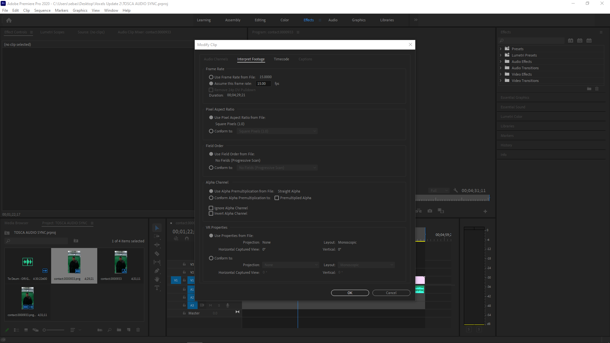

# Evercoast Open Source

Helpful open source scripts and code samples that make consuming Evercoast's volumetric content easier.

Looking for Evercoast, find us at: www.evercoast.com!

## Prerequisites:

**GNU Parallel:**

`sudo apt install parallel`

(Legacy) If parallel complains about citations (you'll know it when you see it), use the following command to silence the messages:

`parallel --bibtex will cite`

**Imagemagick & Montage:**

`sudo apt install imagemagick`
`sudo apt-get install montage`

**Note:**

Depending on your GIT client, you may need to `chmod +x` the BASH scripts described herein.

# RAW Conversion

## Scripts:

`ec-convert-raw-color-1280x720.sh` (D415)

`ec-convert-raw-color-1280x800.sh` (D455)

`ec-convert-raw-depth-1280x720.sh` (D415 | D455)

## Purpose:

Convert RAW images in a take folder to PNG for viewing in parallel.

## Usage:

Each script will process all of the files in the current directory. To isolate the a hero camera, or a subset of the camera's you're intereseted in, make a folder off of your take directory and copy them into it, e.g. (where `############` is the 12-digit device serial number):

`cd mytake.0010.hero.take.001/`

`mkdir HERO_############`

`cp ############-*.raw HERO_############/`

`cd HERO_############/`

`ec-convert-raw-color-1280x720.sh`

# Making Contact Sheets

## Scripts:

`ec-parallel-montage.sh`

`ec-montage.sh`

## Purpose:

Create MxN tiled contact sheets in parallel.

## Usage:

**First:**

Use the above RAW conversion scripts to convert RAW files to PNG.

**Next:**

`ec-parallel-montage.sh 1 2 100 ec-montage.sh 10x2 50`

**Where:**

`ec-parallel-montage.sh` runs the `ec-montage.sh` script in parallel for frames `1` to `100` with an increment of `2`.

`ec-montage.sh` is a wrapper script around the `montage` command, where `10x2` is the desired tiling and `50` is the scaling applied to the final image.

**Note:**

Depending on your where you've cloned `EvercoastOpenSource`, and whether that path is in your shell environment's $PATH variable, both `ec-parallel-montage.sh` and `ec-montage.sh` may need to prefaced by their concrete or relative paths, e.g.:

`~/EvercoastOpenSource/ec-parallel-montage.sh 1 2 100 ~/EvercoastOpenSource/ec-montage.sh 10x2 50`

**Watch Out For:**

If you receive contact sheets of the form `contact.0000235-0.png`, it indicates that your tiling leaves a remainder. Don't use tilings where `MxN < # of image sequences`. Should you have an odd number, e.g. `9` sequences, round up and use a tiling of `5x2`.

## Example Output:

# Viewing Images

We recommend DJV as a free to use review tool, which is provided under a BSD-style license.

Download DJV [HERE](https://darbyjohnston.github.io/DJV/download.html).

# Unity

C# `Editor` and `Playback` scripts for OBJ sequences for playback in Unity.

## Types of Scripts:
**Editor Scripts:**

Editor scripts are used to control the import process for Evercoast assets. As Evercoast's OBJ, material, and texture assets are imported by Unity, these scripts will ensure that they're properly configured.

**Playback Scripts:**

A variety of playback controller scripts.

## Fundamentals:

**Time In Unity:**

Time in Unity is both plural (elapsed time, animation time, physics time, etc.) and non-linear. These times can scale internal to Unity to maintain frame-rate, accommodate complex physics, or other many factors.

Given that there is no unified singular concept of time, to maintain smooth playback while maintaining audio synchronization, we derive our volumetric playback frame based on the position of the read-head of the audio clip that's necessarily associated with each playback controller. Thus, we let Unity internally scale its notion of time however it likes, and we simply lock onto the audio clip and stay in sync.

There are many ways to maintain synchronization. However, we have found this mechanism to be markedly the simplest and most reliable -- under all playback regimes, from `real-time` to using `Unity Recorder` as an offline renderer. So, as you consider the playback controller described herein, please understand maintaining audio-synchronization, for a long duration, under multiple playback mechanisms, as our primary design goal, and hence our reliance on an audio clip as the basis for playback strategy.

## Preparing RAW Frames For Adobe Premiere

Refer to the above `RAW Conversion` section and `Making Contact Sheets` process to create contact sheets for the hero camera, or a subset of cameras where the face is clearly visible.

In the end you'll have an image with the frame filenames, and hence the frame numbers, burned into the bottom of the image place, as so:

## Synchronizing Audio In Adobe Premiere

**Having An Audio File Is A Must:**

If you have not recorded an audio track for your volumetric content, this process is still essential. Please substitute any audio track, e.g. your favorite song.

**Open The Image Sequence:**

In your project in Premiere select `Open`, then use the file browser to locate the first frame of the image sequence of the contact sheets. Please ensure that `Image Sequence` is pressed in the lower left of the file browser dialog before pressing OK.

**Adjust The Image Sequence's FPS:**

Right click on the image sequence and follow the `Modify Clip / Interpret Footage` menu. Set the FPS of the clip to the FPS used at record time in Mavericks.

*Note: Modify Clip must be done before setting any markers, or syncing tracks.*

**Synchronize The Audio:**

Synchronize the audio track to the video track.

**Cut The Track:**

Use the `Cut Tool` to trim any excess frames from the beginning or end of the clip. This is your final `editorial` cut.

**Export An Audio File:**

Export a WAV file. On the export dialog reset the timecode to `00:00:00`.

**Cutting The OBJ Sequence:**

The labels that are burned into the bottom of each contact sheet frame are 1:1 to the OBJ sequence files. From here trim your OBJ sequence to exactly what is used in your editorial from Premiere, either by deleting unneeded files, or by duplicating the sub-range into a separate folder.

## Installing Editor And Playback Scripts in Unity

Copy the `unity/EVERCOAST_SCRIPTS_Vx.y` folder into your Unity project under `Assets`.

## Importing Audio and OBJ Sequences in Unity

**Asset Folders:**

Create a folder under `Assets` called `EVERCOAST CONTENT`. Then, under `EVERCOAST CONTENT` create a folder that begins with the prefix (or is named) `EVERCOAST VOLUMETRIC`, e.g. `EVERCOAST VOLUMETRIC - HERO`.

*Note: The Editor and Playback scripts may refer to the above naming conventions, failing to adhere to these conventions may result in problems.*

**Create AUDIO And FRAMES Sub-Folders:**

For each `EVERCOAST VOLUMETRIC` folder, create sub-folders `AUDIO` and `FRAMES`.

**Audio File:**

Copy the synchronized audio file into `AUDIO`. You'll be notified that it has imported into Unity.

**Frames:**

Copy the synchronized OBJ sequence, that's been cut to match the audio file, into `FRAMES`.

*Note: This may take several minutes.*

*Pro Tip: It may be easier to quit Unity, copy the files, and then restart Unity, rather than doing this either from within Unity, or while Unity is open. Closing the application will avoid Unity incrementally detecting the presence of new files under `Assets`, and trying to import them, prior to the copy finishing.*

## The Controller Game Object

**Evercoast Controller:**

Under the `Hierarchy` view, create an `Empty Game Object` and name or begins with the prefix `EVERCOAST`, e.g. `EVERCOAST - HERO`.

**Adding An Audio Source:**

Use `Add Component` to add an `Audio Source` to the `Evercoast Controller`. Then, set the `Audio Clip` to the synchronized clip that was placed in the `AUDIO` folder.

**Adding The Playback Controller:**

Use `Add Component` again to add Evercoast's `Playback Controller` script.

*Note: There are multiple types of playback controllers, please see internal documentation for usage.*

**See:**

## Frames:

**Select The Frames:**

Under `Assets/EVERCOAST VOLUMETRIC/FRAMES` select the OBJ sequence geometry.

**Drag The Frames Into The Hierarchy:**

Drag and drop the frames so that they're they're children of the `EVERCOAST CONTROLLER`.

**Tagging the Frames:**

Select all of the frames under the `EVERCOAST CONTROLLER` and tag them as `EVERCOAST VOLUMETRIC`. If the `EVERCOAST VOLUMETRIC` tag doesn't exist in your project, first use `Add tag...` to create it.

For further instruction, see [HERE](https://docs.unity3d.com/Manual/Tags.html).

**Setting A Display Frame:**

After creating game objects for the frames they'll all be visible, on top of one another. This not only decreases rendering performance, but makes working with the content all but impossible.

It is strongly recommended that a single hero frame, for instance the first frame in the sequence, is left as visible, and the rest of the frames are hidden. To do this simply select all of the frames, except your hero frame, and toggle their `active` state.

For further instruction, see [HERE](https://docs.unity3d.com/Manual/DeactivatingGameObjects.html).

## Press Play:

Set up is now complete, upon pressing `Play` you'll see the OBJ sequence animate in the `3D Scene` and `Game View`.

## Recommended Tools:

**Post-Processing:**

`Post-processing` layers in Unity are the most compelling way to make realistic scenes.

For further instruction, see [HERE](https://docs.unity3d.com/Manual/PostProcessingOverview.html).

**Timeline:**

Earlier in this document we've discussed that the notion of time in Unity is a flexible concept. To create cinematic content with accurate in/out trigger points, for: starting or stopping volumetric playback, triggering visual or sound effects, etc., the `Timeline` package should be used.

There are other animation mechanisms available in Unity, but only the `Timeline` guarantees the frame accurate triggering of events.

For further instruction, see [HERE](https://docs.unity3d.com/Packages/com.unity.timeline@1.4/manual/index.html).

**Cinemachine:**

Unity's `Cinemachine` package is the most effective resource to create complex camera animation paths that mimic real-world film equipment.

For further instruction, see [HERE](https://docs.unity3d.com/Packages/com.unity.cinemachine@2.3/manual/index.html).

**Unity Recorder:**

To create offline renders, use the `Unity Recorder`. This is a relatively recent addition to Unity, and there are several such components available in the `Asset Store`, those are now redundant.

For further instruction, see [HERE](https://docs.unity3d.com/Packages/com.unity.recorder@2.0/manual/index.html).
